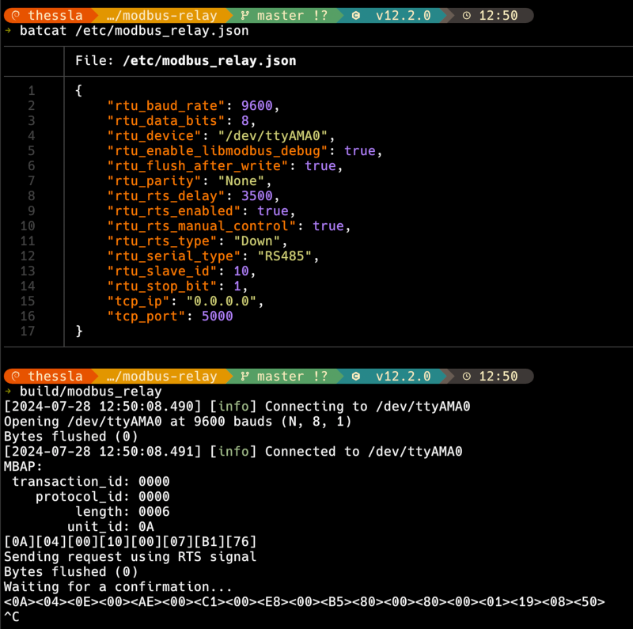
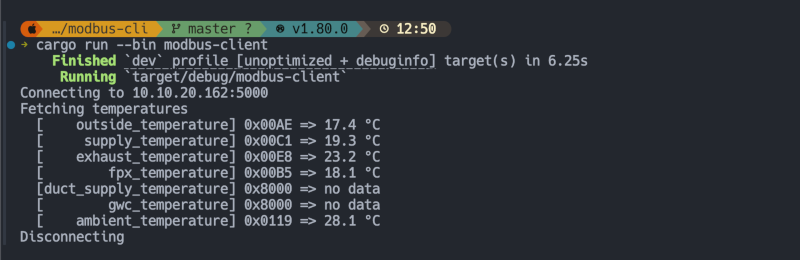

# modbus-relay

MODBUS TCP/IP server that translates incoming requests to RTU and relays them to configured serial device.

> [!CAUTION]
> 🚧 This project is still in WIP 🚧

## Demo

- [Thessla Green](https://thesslagreen.com) recuperator on `/dev/ttyAMA0`
- `modbus-relay` running on Raspberry Pi 3 Model B+, with **debug** enabled



- Client using [rust](https://www.rust-lang.org) & [tokio-modbus](https://github.com/slowtec/tokio-modbus), connects via TCP/IP



## Features

- Exposes RTU device via TCP/IP
- Option to flush after every write[^1]
- Option to manual control of RTS[^1]
- Simple configuration via JSON in `/etc/modbus_relay.json`

[^1]: Needed for a device I was working with

## Tech Stack

- Made with modern C++23
- [cmake](https://cmake.org) for building
- [ASIO](https://think-async.com/Asio/) for networking/io
- [libmodbus](https://github.com/stephane/libmodbus) for MODBUS
- [spdlog](https://github.com/gabime/spdlog) for logging
- [fmt](https://github.com/fmtlib/fmt) for formatting
- [nlohmann_json](https://github.com/nlohmann/json) for JSON

## Roadmap

- [ ] Handle errors

- [ ] Handle function code **0x01** - Read Coil Status

- [ ] Handle function code **0x02** - Read Input Status

- [ ] Handle function code **0x03** - Read Holding Registers

- [X] Handle function code **0x04** - Read Input Registers

- [ ] Handle function code **0x05** - Force Single Coil

- [ ] Handle function code **0x06** - Preset Single Register

- [ ] Handle function code **0x0F** - Force Multiple Coils

- [ ] Handle function code **0x10** - Preset Multiple Registers

- [ ] Handle function code **0x10** - Preset Multiple Registers

- [ ] Handle multiple connections

- [ ] systemd service

## Documentation

Configuration file is in `/etc/modbus-relay.json`. See Usage on how to generate it.

TCP/IP server options:

- `tcp_ip` - on which interface to listen to, ex. `"0.0.0.0"`
- `tcp_port` - on which port to listen to, ex. `5000`

RTU client options:

- `rtu_device` - tty device, ex. `"/dev/ttyAMA0"`
- `rtu_serial_type` - serial type, `"RS232"` | `"RS485"`
- `rtu_baud_rate` - baud rate, ex. `9600`
- `rtu_parity` - parity, `"None"` | `"Even"` | `"Odd"`
- `rtu_data_bits` - data bits, `5` | `6` | `7` | `8`
- `rtu_stop_bit` - stop bit, `1` | `2`
- `rtu_slave_id` - slave id in decimal, ex. `10` (`0x0A`)
- `rtu_rts_enabled` - wheter to use RTS, `true` | `false`
- `rtu_rts_type` - RTS type, `"None"` | `"Up"` | `"Down"`
- `rtu_rts_delay` - delay in us, ex. `3500`
- `rtu_rts_manual_control` - wheter to manually set `TIOCM_RTS` via `ioctl` on `rtu_device`, before and after each write, `true` | `false`
- `rtu_flush_after_write` - wheter to manually call `tcflush(rtu_device, TCIOFLUSH)` after each write, `true` | `false`
- `rtu_enable_libmodbus_debug` - to enable `libmodbus` debug logging, `true` | `false`

## Installation

Install dependencies mentioned in tech stack section

```bash
  mkdir -p build
  cd build
  cmake -DCMAKE_BUILD_TYPE=Release ..
  cmake --build .
```

## Usage

To generate config file

```bash
sudo sh -c './modbus-relay -dump-default-config > /etc/modbus-relay.json'
```

Just run it

```bash
./modbus-relay
```

## FAQ

### Why?

Needed to expose RTU device via TCP/IP, because developing on RPI3B+ was painfully slow and full of OOMs

## License

[MIT](https://choosealicense.com/licenses/mit/)

## Authors

- [@aljen](https://www.github.com/aljen)
